<div align="center">

# 🐳 Docker Basics — Study Notes

**From `docker run` to Compose, BuildKit, networking and registries**
*Written for junior DevOps learners: concept first, real-world scenario next, commands last.*


</div>

---

## 🗝 How to read these notes

| Marker | Meaning |
|:--:|---|
| 💛 | **Memorize this.** Commands or facts you should know without looking |
| 🧪 | **Try it.** Hands-on lab, run it yourself |
| 🎬 | **Scenario.** Where you will meet this in real life |
| ⚠️ | **Gotcha.** A mistake that bites beginners |

> [!TIP]
> Don't just read. Run every 🧪 block on your own machine. Repetition in the terminal is what makes commands stick.

---

## 📑 Table of Contents

1. [Big Picture](#-big-picture)
2. [Core Commands](#-core-commands)
3. [Port Mapping](#-port-mapping)
4. [Volumes and Storage](#-volumes-and-storage)
5. [Inspect and Logs](#-inspect-and-logs)
6. [Dockerfile](#-dockerfile)
7. [BuildKit (Modern Builder)](#-buildkit-modern-builder)
8. [Docker Networking](#-docker-networking)
9. [Example: Voting App without Compose](#-example-voting-app-without-compose)
10. [Docker Compose](#-docker-compose)
11. [Example: Voting App with Compose](#-example-voting-app-with-compose)
12. [Remote Docker](#-remote-docker)
13. [Under the Hood](#-under-the-hood)
14. [Docker Registry](#-docker-registry)
15. [Docker on Windows](#-docker-on-windows)
16. [Quick Tips and Gotchas](#-quick-tips-and-gotchas)

---

## 🐳 Big Picture

**Docker packages your app and everything it needs (runtime, libraries, config) into one box called a *container*.** The box runs the same on your laptop, on a teammate's PC and on a production server.

> 🎬 **Scenario:** "It works on my machine!" A developer's app needs Python 3.11, but the server has Python 3.8. With Docker you ship the app *with* Python 3.11 inside the box. Problem gone.

| Term | Simple meaning | Analogy |
|---|---|---|
| **Dockerfile** | Text file with build steps | A recipe |
| **Image** | Read-only package built from the Dockerfile | A frozen meal / a class |
| **Container** | A running instance of an image | The meal being eaten / an object |
| **Registry** | Online storage for images (Docker Hub) | An app store |

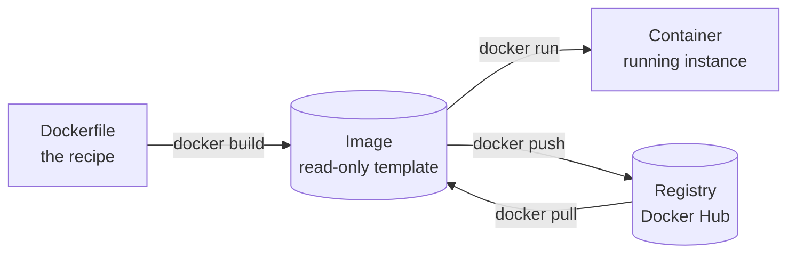

💛 **One image can start many containers.** Deleting a container never deletes the image.

---

## 🚀 Core Commands

### The container lifecycle

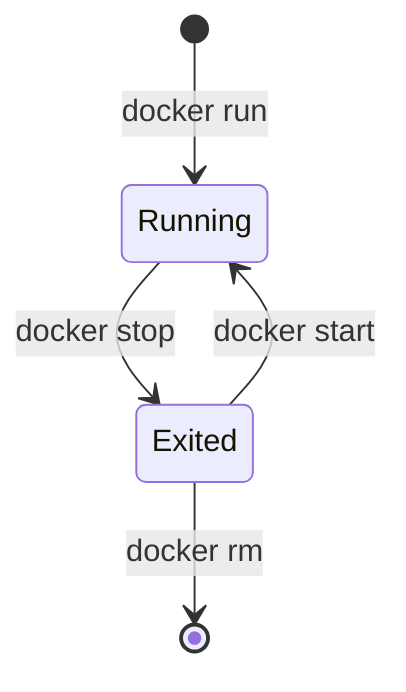

### 💛 Essential commands

| Command | What it does |
|---|---|
| `docker run <image:tag>` | Create and start a container (pulls the image if missing) |
| `docker pull <image:tag>` | Download an image only |
| `docker ps` | List **running** containers |
| `docker ps -a` | List **all** containers (including stopped) |
| `docker images` | List images on this machine |
| `docker rmi <image or id or ids>` | Delete image(s) |
| `docker stop <containerids>` | Stop container(s) gracefully |
| `docker rm <container ids separated with spaces>` | Delete stopped container(s) |
| `docker system prune` | Cleanup (see below) |

> ⚠️ `docker rmi` fails if a container (even a stopped one) still uses the image. Remove the container first with `docker rm`.

> ⚠️ **Always pin a tag** (`nginx:1.27`, not just `nginx`). No tag means `latest`, which can change under you and break your app tomorrow.

### 🧪 Run a command in a container

```bash
docker run ubuntu sleep 3600            # runs 'sleep' for 1 hour in the foreground
docker ps -a                            # find the container id here

docker exec <containerid from previous> cat /etc/hosts     # run a command INSIDE a running container
```

### Detached mode (run in the background)

```bash
docker run -d kodekloud/simple-webapp   # -d = detached, the terminal is free again
docker attach <containerid>             # reattach to the terminal
```

> 🎬 **Scenario:** A web server should keep running after you close the terminal. That is what `-d` is for.

> ⚠️ Inside `docker attach`, pressing `Ctrl+C` can **stop the container**. To leave without stopping it, press `Ctrl+P` then `Ctrl+Q`.

### Interactive mode

By default a container does **not** listen to your keyboard (stdin). To interact with it:

```bash
docker run -it kodekloud/simple-prompt-docker
```

| Flag | Meaning |
|:--:|---|
| `-i` | Keep stdin open. Alone, this lets you **pipe data into** the container |
| `-t` | Allocate a terminal (TTY): pretty formatting, colors, progress bars |
| `-it` | Both together. Use this for anything interactive, e.g. `docker run -it ubuntu bash` |

### Cleanup

```bash
docker system prune
```

Removes: all stopped containers, all networks not used by at least one container, all dangling images and all unused build cache.

> ⚠️ Read the confirmation prompt. Add `-a` only if you also want to delete **all unused images**.

### Handy extras

```bash
docker run --rm ubuntu echo hi     # auto-delete the container when it exits (great for tests)
docker run --name myweb nginx      # give the container a name instead of a random one
docker rm -f <container>           # force-remove even if running
docker start <container>           # start a stopped container again
docker restart <container>
```

---

## 🔌 Port Mapping

A container has its own private network. Nobody outside can reach it until you **publish a port**.

> 🎬 **Scenario:** Your Flask app listens on port `5000` *inside* the container. Users should open `http://your-server:80`. Map host port 80 to container port 5000.

```bash
docker run -p 80:5000 kodekloud/webapp     # -p HOST_PORT:CONTAINER_PORT
```


💛 **Format is `HOST:CONTAINER`.** The left side is the machine, the right side is the container.

- Map the container port to any **free** port on the host. Running two copies of the same app? Use two host ports: `-p 8080:80` and `-p 8081:80`.
- Only local access: `-p 127.0.0.1:8080:80`
- Random host port: `-P` (capital P) publishes all exposed ports

> ⚠️ `port is already allocated` means that host port is taken by another process or container. Pick another one on the **left** side.

---

## 💾 Volumes and Storage

A container's filesystem **dies with the container**. To keep data, map a folder from the host into the container.

> 🎬 **Scenario:** You run MySQL in a container and then remove it to upgrade. Without a volume, **all your database data is gone**. With a volume, the new container picks up the old data.

```bash
docker run -v /opt/datadir:/var/lib/mysql mysql      # HOST_DIR:CONTAINER_DIR
```

### 💛 Three types of mounts

| Type | Where data lives | Managed by Docker? | Best for |
|---|---|:--:|---|
| **Volume** | `/var/lib/docker/volumes/` | ✅ Yes | Databases, production data |
| **Bind mount** | Any host path **you** choose | ❌ No | Live-editing code during development |
| **tmpfs** | Host **RAM** only | ✅ | Temporary or sensitive data, gone at stop |

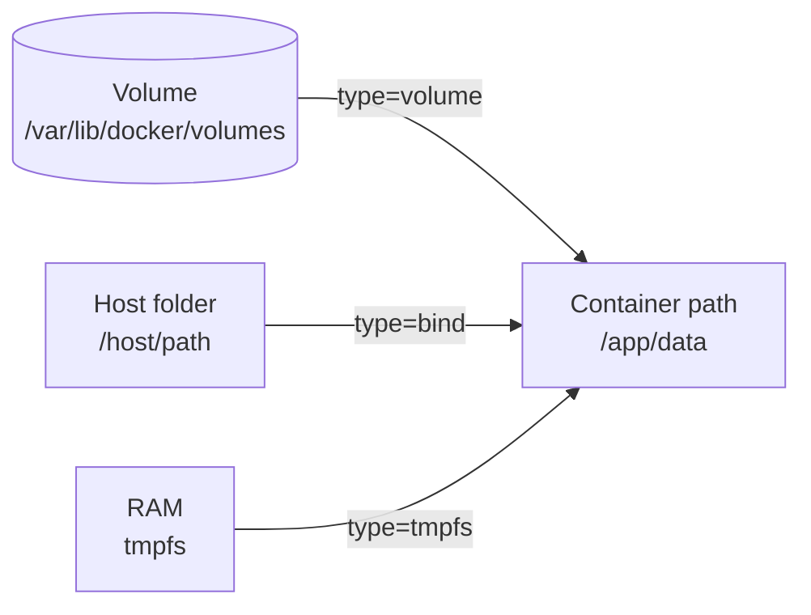

**Volume**: Docker abstracts the storage location under `/var/lib/docker/volumes/`. It is fully managed, works across platforms and is isolated from changes on the host OS.
```bash
docker run -d --mount type=volume,source=v_name,target=/app/data nginx
```

**Bind mount**: maps an exact absolute host path straight into the container, bypassing Docker's management.
```bash
docker run -d --mount type=bind,source=/host/path,target=/app/data nginx
```

**tmpfs mount**: a temporary, volatile filesystem in host memory (RAM). Nothing touches the disk.
```bash
docker run -d --mount type=tmpfs,destination=/app/cache nginx
```

### `-v` vs `--mount`

| | `-v` (short) | `--mount` (explicit, recommended) |
|---|---|---|
| Named volume | `-v mydata:/app/data` | `--mount type=volume,source=mydata,target=/app/data` |
| Bind mount | `-v /host/path:/app/data` | `--mount type=bind,source=/host/path,target=/app/data` |

> ⚠️ With `-v`, a source **without a slash** (`mydata`) is a named volume. A source **with a slash** (`/host/path`) is a bind mount. A typo silently creates the wrong type. `--mount` errors out instead.

### Managing volumes

```bash
docker volume create db-data
docker volume ls
docker volume inspect db-data
docker volume rm db-data
docker volume prune          # remove all unused volumes
```

> ⚠️ **WSL2 tip:** keep bind-mounted project files inside the Linux filesystem (`~/project`), not `/mnt/c/...`. Access across the Windows boundary is much slower.

---

## 🔍 Inspect and Logs

```bash
docker inspect <container name / id>     # full JSON details: IP, mounts, env vars, ports, config
docker logs <container name / id>        # what the app printed (stdout/stderr)
```

> 🎬 **Scenario:** Container exits immediately after `docker run -d`. Run `docker ps -a` to spot it, then `docker logs <id>` to read the error. This is your first debugging step, always.

```bash
docker logs -f <container>            # follow live, like tail -f
docker logs --tail 50 <container>     # last 50 lines only
docker inspect -f '{{.NetworkSettings.IPAddress}}' <container>   # pull out one field
docker stats                          # live CPU / memory per container
docker top <container>                # processes inside the container
docker cp <container>:/path/file .    # copy a file out of a container
```

---

## 📄 Dockerfile

A **Dockerfile** is a text recipe. `docker build` follows it top to bottom and produces an **image**.

### Example

```dockerfile
FROM ubuntu

RUN apt-get update
RUN apt-get install -y python3-flask

COPY app.py /opt/app.py

ENV FLASK_APP=/opt/app.py
ENTRYPOINT flask run --host=0.0.0.0
```

### 💛 What each instruction does

| Instruction | Meaning |
|---|---|
| `FROM` | Starting image (the base). Always the first line |
| `RUN` | Run a command **while building** (install packages) |
| `COPY` | Copy files from your machine into the image |
| `ENV` | Set an environment variable |
| `ENTRYPOINT` | The program that runs **when the container starts** |
| `CMD` | Default arguments for that program (see the section below) |
| `WORKDIR` | Set the working directory for the following steps |
| `EXPOSE` | Documents which port the app uses (does **not** publish it) |
| `ARG` | Build-time variable (`--build-arg`) |
| `USER` | Run as a non-root user (safer) |

### Build, push, inspect

```bash
docker build -t adithyan/my-app .     # -t = name:tag   |   the . = Dockerfile is in the current directory
docker push adithyan/my-app           # upload to the registry
docker history <image_name>           # show every layer and the command that created it
docker build -t webapp .              # same build, shorter local name
```

🧪 **Practice project:** [simple-flask-app-container-image-builder](https://github.com/ksadithyan/simple-flask-app-container-image-builder.git)

### Layers and cache

Every instruction creates a **layer**. Docker caches layers. If a step and everything above it is unchanged, Docker reuses the cache. When one layer changes, **every layer below it rebuilds**.

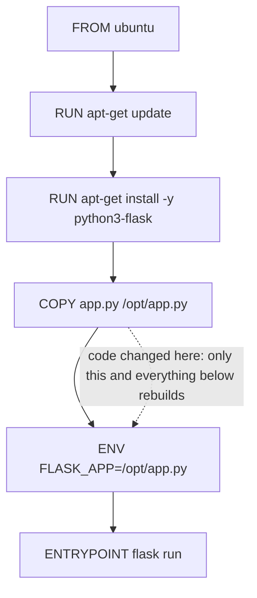

💛 **Order rule:** things that rarely change (install packages) go **on top**. Things that change often (your code) go **at the bottom**. Your rebuilds become seconds instead of minutes.

### A slightly better version of the same file

```dockerfile
FROM ubuntu:22.04
RUN apt-get update && apt-get install -y python3-flask && rm -rf /var/lib/apt/lists/*
COPY app.py /opt/app.py
ENV FLASK_APP=/opt/app.py
EXPOSE 5000
ENTRYPOINT ["flask", "run", "--host=0.0.0.0"]
```

- Pinned base tag, so builds are repeatable.
- `apt-get update && install` in **one** `RUN`. Separate lines can reuse a stale cached `update` and later fail on install.
- `rm -rf /var/lib/apt/lists/*` in the same `RUN` keeps the image small.
- `ENTRYPOINT [...]` uses the exec form (see below).

### `.dockerignore`

Sits next to the Dockerfile. Lists files that must **not** be sent to the build (like `.gitignore`).

```text
.git
node_modules
*.log
.env
__pycache__/
```

> 🎬 **Scenario:** Without it, `COPY . .` drags your `.git` folder, logs and `.env` secrets into the image. That makes builds slower and images bigger, and it can leak secrets.

### ENTRYPOINT vs CMD

Concept first: **`ENTRYPOINT` is the fixed program. `CMD` is the default argument that a user can override.**

```dockerfile
ENTRYPOINT ["sleep"]
CMD ["5"]
```

| You run | What actually executes |
|---|---|
| `docker run sleeper` | `sleep 5` (CMD default is used) |
| `docker run sleeper 20` | `sleep 20` (your argument **replaces CMD**) |
| `docker run --entrypoint echo sleeper hi` | `echo hi` (`--entrypoint` replaces ENTRYPOINT) |

> 🎬 **Scenario:** You build a "sleep" image. It should always run `sleep`, but the user chooses the seconds. `ENTRYPOINT` fixes the program, `CMD` gives a default of 5 seconds.

**Two syntaxes:**

| Form | Example | Notes |
|---|---|---|
| **Exec form** ✅ | `ENTRYPOINT ["sleep"]` | JSON array with double quotes. Your program becomes PID 1, so it receives `docker stop` signals properly |
| **Shell form** | `ENTRYPOINT sleep` | Wrapped in `/bin/sh -c`. Signals may not reach your app, so stops are slow |

> ⚠️ Write `ENTRYPOINT ["sleep"]` (with a space, double quotes and brackets). `ENTRYPOINT["sleep"]` and `CMD[5]` are invalid.

### Environment variables: best practices

Concept: **build one image, run it everywhere, and change behavior with environment variables** instead of editing code.

> 🎬 **Scenario:** The same image runs in dev, staging and prod. Only `DB_HOST` and `DB_PASSWORD` differ. You pass them at run time and never rebuild.

```bash
docker run -e DB_HOST=db.prod.internal -e LOG_LEVEL=info myapp   # one at a time
docker run --env-file .env myapp                                  # many at once from a file
```

| ✅ Do | ❌ Don't |
|---|---|
| Keep config (URLs, ports, log level) in env vars | Hardcode config inside the code or image |
| Set safe **defaults** with `ENV` in the Dockerfile | Put passwords or API keys in `ENV` or `ARG` (they stay in image history) |
| Use `--env-file` / Compose `env_file` per environment | Commit `.env` to Git. Add it to `.gitignore` and `.dockerignore` |
| Use secret tools for sensitive values (BuildKit `--secret`, Docker/Compose secrets, Vault, cloud secret managers) | Assume env vars are private. `docker inspect` shows them to anyone with Docker access |

💛 **Rule of thumb:** Config goes in env vars. Real secrets go in a secrets manager.

---

## ⚡ BuildKit (Modern Builder)

### ❌ Major problems with the traditional Docker builder

| # | Problem | Why it hurts |
|:--:|---|---|
| 1 | **Re-downloading packages every build** | Change one line of code and `pip install` downloads everything again |
| 2 | **Secrets leak into image metadata** | Anyone who pulls the image can dig them out with `docker history` |
| 3 | **Architecture lock-in** | An image built on your Intel/AMD PC will not run on ARM (Apple M-series, Raspberry Pi, AWS Graviton) |
| 4 | **Independent stages run one after another** | Slow builds |

**How secrets leak (problem 2):**

1. `ENV` → the value gets baked into the build history
2. `COPY` + `rm` → the file is still in the earlier layer, deleting it later hides nothing
3. `--build-arg` → the value gets baked into the build history
4. Multi-stage builds → better, but risky, so not preferable for secrets

**Bad fixes for architecture lock-in (problem 3):**

1. Keep a separate build machine per architecture
2. Set up QEMU emulation by hand

### ✅ BuildKit: the modern approach that solves all of the above

```bash
docker buildx build -t adithyan/web-app .
```

| Problem | BuildKit fix |
|---|---|
| 1. Re-downloading packages | Cache mount |
| 2. Secret leaks | Secret mount |
| 3. Architecture lock-in | `--platform` (multi-arch build) |
| 4. Sequential stages | Runs independent stages in parallel, **automatically** |

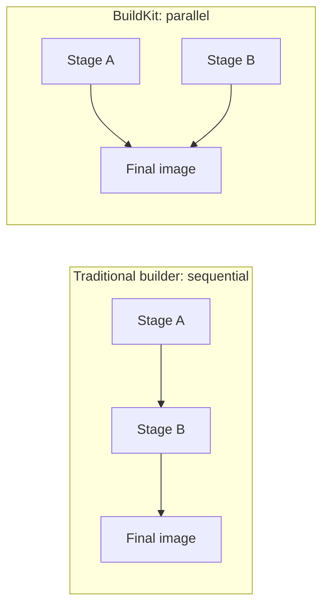

### 1) Cache mount: stop re-downloading packages

```dockerfile
RUN --mount=type=cache,target=/root/.cache/pip pip install -r requirements.txt
```

Replace `/root/.cache/pip` with the cache folder of your tool and put the command you need after it. The downloaded files are kept between builds, so builds speed up. The cache is **not** stored in the final image.

### 2) Secret mount: no trace left in the image

In the Dockerfile:
```dockerfile
RUN --mount=type=secret,id=mykey cat /run/secrets/mykey     # use whatever command you need here
```

When you build, pass the secret from outside. Here the key lives in `key.txt` in the same folder:
```bash
docker buildx build --secret id=mykey,src=./key.txt -t myapp .
```

The secret exists only during that one `RUN` step, at `/run/secrets/<id>`. It is never written into a layer or into history.

### 3) Multi-architecture builds

```bash
docker buildx build --platform linux/amd64,linux/arm64 -t ksadithyan/webapp .     # use any proper image name
```

Finish the command with `--push` to push it to the registry under **one name** as a **multi-arch manifest**. Docker then pulls the right version for whatever machine runs it.

```bash
docker buildx build --platform linux/amd64,linux/arm64 -t ksadithyan/webapp --push .
```

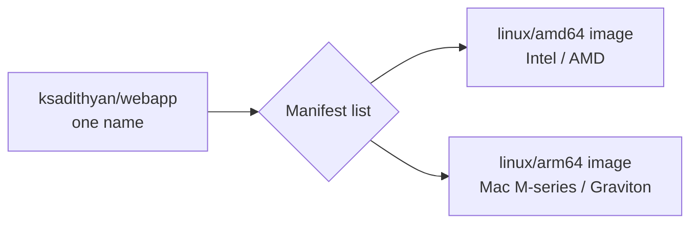

> ⚠️ Multi-platform results can't be loaded into the local image list with the classic setup, which is why you `--push`. If buildx complains, create a builder first: `docker buildx create --use`.

### 4) Parallel stages: zero extra effort

`buildx` runs independent pieces side by side by default. Nothing to configure.

### Multi-stage builds (concept)

Build in one stage (with heavy compilers and tools), then copy **only the result** into a small final stage.

```dockerfile
FROM golang:1.22 AS builder
WORKDIR /src
COPY . .
RUN go build -o app

FROM alpine:3.20
COPY --from=builder /src/app /app
ENTRYPOINT ["/app"]
```

Result: a tiny image without compilers and source code. Good for size. As noted above, **don't rely on it to hide secrets**. Use BuildKit secret mounts.

---

## 🌐 Docker Networking

Containers talk to each other and to the outside through Docker networks.

```bash
docker network create <network-name>
docker network ls
docker network inspect <network-name>
docker network rm <network-name>
```

### 💛 Network types

```bash
docker run --network=x ubuntu      # x can be: bridge, none, host
```

| Type | What happens | Use it when |
|---|---|---|
| **bridge** (default if you don't specify `--network`) | Private network on the host. Containers on it can talk to each other | Almost always |
| **host** | Container shares the host's network directly. **No isolation** | You need max network speed, or many ports |
| **none** | No network at all | Fully isolated batch jobs |

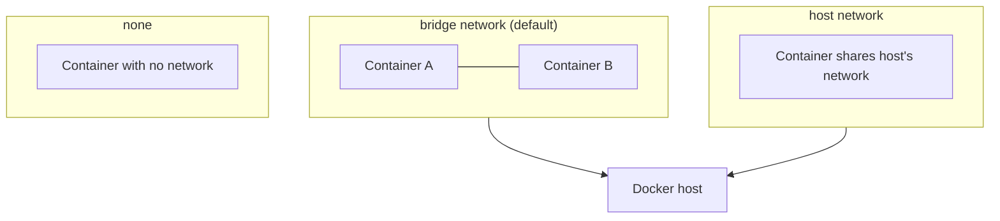

> ⚠️ With `host`, the container is mapped straight onto the host. **Port entries are fixed**: both sides are the same port, so `-p` has no meaning. Two containers wanting the same port will clash. Host mode is fully supported on Linux only; on Docker Desktop (Windows) it behaves differently.

### 💛 Custom networks give you DNS by name

On a **user-created** network, containers reach each other **by container name**. On the *default* bridge they can't.

> 🎬 **Scenario:** Your web app connects to a database with the hostname `db`. That only works if both containers are on the same custom network and the DB container is named `db`.

```bash
docker network create voting-app
docker run -d --name db --network voting-app postgres:15-alpine
docker run -d --name web --network voting-app myapp      # "web" can now reach "db" by name
```

### Isolate another network

Create a separate network with its own subnet. Containers on different networks can't talk to each other.

```bash
docker network create --driver bridge --subnet 182.18.0.0/16 your-isolated-netwrk-name
```

> 🎬 **Scenario:** Keep the customer-facing app network and the internal admin tools network separate, so a compromised web container can't reach the admin tools.

Connect or disconnect a running container:
```bash
docker network connect  <network> <container>
docker network disconnect <network> <container>
```

---

## 🗳 Example: Voting App without Compose

Repo: <https://github.com/dockersamples/example-voting-app.git>

### Architecture

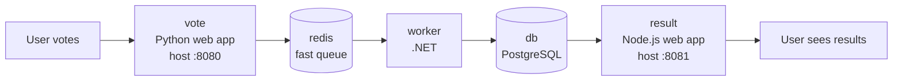

Five pieces, so five long `docker run` commands. That is the pain Compose fixes later.

### 🧪 Steps

```bash
git clone https://github.com/dockersamples/example-voting-app.git
cd example-voting-app

# 1. Build the three custom images
docker build -t vote   ./vote
docker build -t result ./result
docker build -t worker ./worker

# 2. Create a network so containers can find each other by name
docker network create voting-app

# 3. Run everything on that network
docker run -d --name vote   -p 8080:80 --network voting-app vote
docker run -d --name result -p 8081:80 --network voting-app result
docker run -d --name worker --network voting-app worker
docker run -d --name redis  --network voting-app redis:alpine
```

The database needs settings and a volume so data survives:
```bash
docker run -d --name db --network voting-app \
-e POSTGRES_USER=postgres \
-e POSTGRES_PASSWORD=postgres \
-v db-data:/var/lib/postgresql/data \
postgres:15-alpine
```

Open <http://localhost:8080> to vote and <http://localhost:8081> to see results.

> ⚠️ The apps look for the hostnames **`redis`** and **`db`**. That is why the containers must be named exactly `redis` and `db` **and** sit on the same custom network.

---

## 🐙 Docker Compose

Compose describes a **whole multi-container app in one YAML file** and starts it with one command.

> 🎬 **Scenario:** A new teammate joins. Instead of running 5 long commands from a wiki page, they run `docker compose up`.

### Typical project layout

```text
myproject/
├── compose.yaml        # the main file (older name: docker-compose.yml)
├── .env                # variables for the YAML and/or containers (never commit)
├── .dockerignore       # keeps junk out of image builds
├── vote/
│   ├── Dockerfile
│   └── ...
└── worker/
    ├── Dockerfile
    └── ...
```

### 💛 Commands

```bash
docker compose up                # create network + containers, run in the foreground
docker compose up -d             # same, in the background
docker compose up --build        # rebuild images first
docker compose ps                # what is running
docker compose logs -f           # follow logs of all services
docker compose stop              # stop, keep containers
docker compose down              # stop AND remove containers + network
docker compose down -v           # ...and also remove volumes (deletes data!)
docker compose config            # validate and print the final resolved file
docker compose -f other.yml up   # use a specific file
```

### Common keys

| Key | Meaning |
|---|---|
| `image` | Use an existing image |
| `build` | Build from a Dockerfile: `build: ./vote` |
| `ports` | Same as `-p` |
| `environment` / `env_file` | Same as `-e` / `--env-file` |
| `volumes` | Same as `-v` |
| `networks` | Attach to custom networks |
| `depends_on` | Start order (see below) |
| `healthcheck` | How Docker checks the service is really working |
| `restart` | `no`, `always`, `on-failure`, `unless-stopped` |
| `profiles` | Only start this service when you ask for it |
| `init` | Run a tiny init process as PID 1 |

### `depends_on` and health checks

Plain `depends_on` only waits for the container to **start**, not to be **ready**. A database takes seconds to accept connections after its container starts.

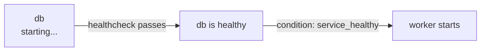

```yaml
services:
  db:
    image: postgres:15-alpine
    healthcheck:
      test: ["CMD-SHELL", "pg_isready -U postgres"]
      interval: 5s
      timeout: 5s
      retries: 5

  worker:
    image: worker
    depends_on:
      db:
        condition: service_healthy     # wait until the healthcheck passes
```

| `condition` | Waits until |
|---|---|
| `service_started` (default) | The container has started |
| `service_healthy` | The healthcheck reports healthy |
| `service_completed_successfully` | The container ran and exited with code 0 (good for migrations/init jobs) |

### `profiles`: optional services

Services with a profile are **skipped** unless you request that profile.

```yaml
services:
  adminer:
    image: adminer
    ports: ["8082:8080"]
    profiles: ["debug"]
```

```bash
docker compose up                      # adminer is NOT started
docker compose --profile debug up      # adminer IS started
```

> 🎬 **Scenario:** A DB admin UI or a test-data seeder that you only want on your laptop, never in production.

### `init: true`

Your app runs as **PID 1** inside the container, and PID 1 does not get normal signal handling or clean up dead child processes (zombies). `init: true` adds a tiny init process that does both. (`docker run --init` is the same thing.)

> 🎬 **Scenario:** `docker compose stop` hangs for 10 seconds and then kills the container. The app ignores the stop signal as PID 1. `init: true` fixes that.

```yaml
services:
  app:
    image: myapp
    init: true
```

### `.env` vs `env_file`: don't confuse them

| | What it does |
|---|---|
| **`.env` file** (auto-read by Compose) | Fills `${VARIABLES}` inside the compose YAML itself, e.g. `image: postgres:${PG_VERSION}` |
| **`env_file:`** key | Passes variables **into the container** |

---

## 🗳 Example: Voting App with Compose

Same repo: <https://github.com/dockersamples/example-voting-app.git>

`docker-compose-simple.yml`

```yaml
services:
  vote:
    image: vote
    ports:
      - "8080:80" 

  result:
    image: result
    ports:
      - "8081:80"

  worker:
    image: worker
  
  redis:
    image: redis:alpine
  
  db:
    image: postgres:15-alpine
    environment:
      POSTGRES_USER: postgres
      POSTGRES_PASSWORD: postgres
    volumes:
      - db-data:/var/lib/postgresql/data

volumes:
  db-data:

# NOTE: you can also use the build and then location to the Dockerfile to build, 
# but since i have the images already built i'm just using the image in the compose. 
# also you can use the .env file - 
#-------------------------------------.env----------------------------------------------------
# POSTGRES_USER=postgres
# POSTGRES_PASSWORD=postgres
#---------------------------------------------------------------------------------------------
# then use the below instead of the "environment: " in the docker compose.
#----------------------------------------yaml edit--------------------------------------------
# env_file:
#   - .env
#---------------------------------------------------------------------------------------------
```

Start:
```bash
docker compose -f docker-compose-simple.yml up
```
This also creates a network automatically along with the containers. Services reach each other by **service name** (`redis`, `db`), which is exactly what the apps expect.

Stop:
```bash
docker compose -f docker-compose-simple.yml down
```

### Compose vs manual, side by side

| | Manual (`docker run`) | Compose |
|---|---|---|
| Network | `docker network create` yourself | Created automatically |
| Start | 5+ long commands | `docker compose up` |
| Stop and clean up | Stop/remove each container | `docker compose down` |
| Config lives in | Your shell history | A file you can commit to Git |

### 🧪 Level up: a more robust version

Builds from source, waits for healthy dependencies, and reads credentials from `.env`.

```yaml
services:
  vote:
    build: ./vote
    ports: ["8080:80"]
    depends_on:
      redis:
        condition: service_healthy
    init: true

  result:
    build: ./result
    ports: ["8081:80"]
    depends_on:
      db:
        condition: service_healthy

  worker:
    build: ./worker
    depends_on:
      redis:
        condition: service_healthy
      db:
        condition: service_healthy

  redis:
    image: redis:alpine
    healthcheck:
      test: ["CMD", "redis-cli", "ping"]
      interval: 5s
      timeout: 3s
      retries: 5

  db:
    image: postgres:15-alpine
    env_file:
      - .env
    volumes:
      - db-data:/var/lib/postgresql/data
    healthcheck:
      test: ["CMD-SHELL", "pg_isready -U postgres"]
      interval: 5s
      timeout: 5s
      retries: 5

volumes:
  db-data:
```

---

## 🔐 Remote Docker

By default the CLI talks to Docker on your own machine. It can also control a Docker daemon on **another** host.

> 🎬 **Scenario:** Deploy or debug containers on a cloud VM without logging in to it.

```bash
docker -H=10.123.2.1:2376 --tlsverify run nginx
```

`--tlsverify` also needs certificates (`--tlscacert`, `--tlscert`, `--tlskey`) or the matching `DOCKER_CERT_PATH`.

| Way | Verdict |
|---|---|
| Port **2375** (plain TCP) | ❌ **Never.** Unencrypted, and anyone who reaches it owns your host |
| Port **2376** with TLS | ✅ OK, more setup (certificates) |
| **`ssh://user@host`** | ✅ **Best.** Uses SSH keys you already have |

```bash
docker -H ssh://user@host ps                                   # one-off command over SSH

docker context create myserver --docker "host=ssh://user@host" # save it as a context
docker context use myserver                                    # all docker commands now go to the server
docker context use default                                     # come back to local
```

---

## 🧬 Under the Hood

### What happens when you type `docker run`

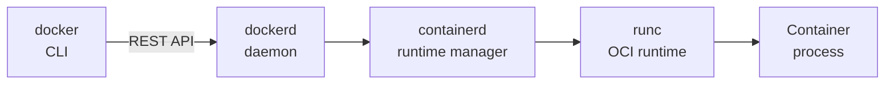

| # | Component | Role |
|:--:|---|---|
| 1 | `docker` | The **CLI** you type into. It only sends requests |
| 2 | `dockerd` | The **daemon**: manages images, networks, volumes |
| 3 | `containerd` | The **runtime manager**: starts, stops and supervises containers |
| 4 | `runc` | The **OCI** low-level runtime that actually creates the container using kernel features |

### Namespaces: what a container can *see*

A container is just a normal Linux process. Namespaces give it its **own private view** of the system.

- The container's process has **PID 1** inside the container, but a normal, different PID on the host. It is the same process with two numbers.
- Containers **share the host kernel**, so isolation is weaker than a virtual machine.

| Namespace | Isolates |
|---|---|
| PID | Process IDs |
| NET | Network interfaces, ports |
| MNT | Filesystem mounts |
| UTS | Hostname |
| IPC | Shared memory / messaging |
| USER | User and group IDs |

🧪 See it: run `docker run -d ubuntu sleep 3600` and then `docker top <container>` (this shows the host-side PID).

### cgroups: how much a container can *use*

Namespaces decide what a container sees. **cgroups** decide how much CPU and memory it may consume.

```bash
docker run --cpus=0.5 ubuntu          # at most half a CPU core
docker run --memory=100m ubuntu       # at most 100 MB RAM (exceed it and the container is killed)
```

> 🎬 **Scenario:** One buggy container with a memory leak must not eat the whole server and take down its neighbours. Limits contain the damage. Check them with `docker stats`.

### Docker storage

Everything lives under `/var/lib/docker`:

```text
/var/lib/docker/
├── containers/    # logs and config of each container
├── image/         # image metadata
├── volumes/       # named volumes
└── overlay2/      # the layers themselves (default storage driver)
```

- **Image layers are read-only.** A running container adds one thin **writable layer** on top. Delete the container and that layer is gone. That is why you need volumes.
- On Docker Desktop with WSL2, this directory is inside Docker's own hidden WSL distro, not inside your Ubuntu one.

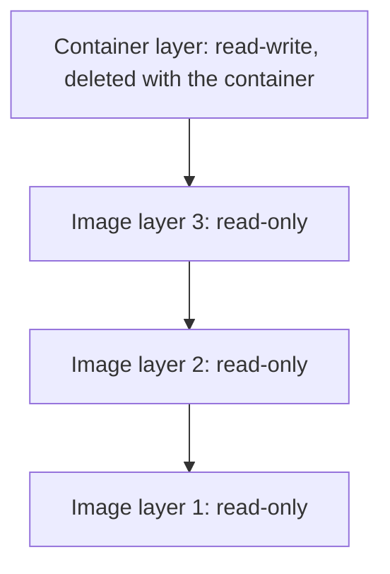

---

## 📦 Docker Registry

A registry stores and serves images. **Docker Hub** is the default public one.

### Image name anatomy

`name/app:version`, and for a private registry: `privateregistry.io/xyz/appname:version`

| Part | Example | Meaning |
|---|---|---|
| Registry | `privateregistry.io` | Where it lives (omit it and Docker Hub is used) |
| User / org | `xyz` | Owner namespace |
| Repository | `appname` | The app |
| Tag | `version` | Version label |

- `nginx` is short for `docker.io/library/nginx:latest`.
- **Always log in before pushing or pulling from a private registry:**

```bash
docker login privateregistry.io
```

> ⚠️ Always mind the **pull rate limits** on Docker Hub and authenticate whenever you can. CI pipelines that pull anonymously are the classic victims.

### Running your own registry

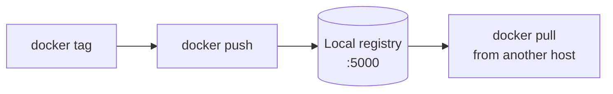

**1) Set up the local private registry**
```bash
docker run -d -p 5000:5000 --name registry registry:2
```

**2) Tag the image with the registry address**
```bash
docker image tag my-image localhost:5000/my-image
```

**3) Push**
```bash
docker push localhost:5000/my-image
```

**4) Pull from anywhere within this network**
Use `localhost` if you're on the same host, or the **IP or domain name** of your Docker host from another machine:
```bash
docker pull 192.168.56.100:5000/my-image
```

> ⚠️ `localhost:5000` works over plain HTTP. Any **other** address needs TLS, or you must list it under `insecure-registries` in the Docker daemon config on the pulling machine. Otherwise you'll see an HTTPS error.

---

## 🪟 Docker on Windows

- **Docker Desktop** is a *developer workstation* product. It is not for production servers.
- Its **default mode is Linux containers** (on WSL2 for you). Switch to **Windows containers** mode only when you need to run a Windows application.
- On **Windows Server 2019 / 2022 / 2025**, use the **Docker Engine-only install**, not Docker Desktop.

### Two types of Windows containers

| | Windows Server container | Hyper-V isolation |
|---|---|---|
| Kernel | **Shares** the host kernel (like Linux containers) | Has its **own** kernel in a lightweight VM |
| Security | Standard | Better isolation |
| Version match | Host and image versions must be compatible | Different kernel versions can coexist |

### Base images: what `FROM` becomes

| Image | Meaning |
|---|---|
| **Windows Server Core** | Full-fledged, heavy |
| **Nano Server** | The Alpine equivalent: small size |

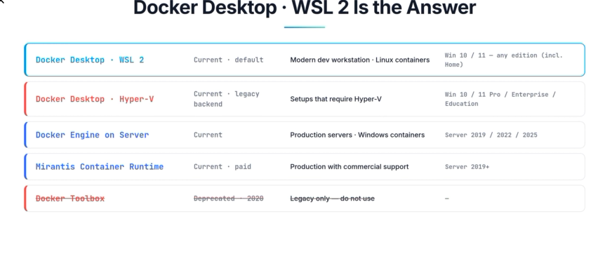

---

## 💡 Quick Tips and Gotchas

- 💛 Image = template, container = running copy. Deleting a container never deletes its image.
- 💛 `-p HOST:CONTAINER`, `-v HOST:CONTAINER`. Left is always the host.
- Pin image tags. `latest` is a moving target.
- No `-d` means the container ties up your terminal. Use `-d` for servers.
- Container exits right away? `docker ps -a` and then `docker logs <id>`.
- Container data disappears on `docker rm`. Anything important goes in a volume.
- Build order matters: slow, rarely-changing steps first. Your code last.
- Never put secrets in `ENV`, `ARG` or `COPY`. Use BuildKit `--secret`.
- Containers find each other **by name** only on a **custom** network (Compose creates one for you).
- `depends_on` alone does not mean "ready". Add a `healthcheck` plus `condition: service_healthy`.
- `docker compose down -v` deletes your volumes and therefore your data.
- Never expose the Docker daemon on port 2375. Use `ssh://`.
- Run `docker system prune` regularly on your laptop. Old images and cache eat disk fast.
- On WSL2, keep project files in the Linux filesystem for speed.
